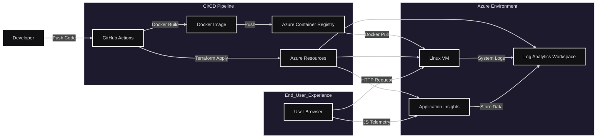

# System Architecture

## Overview

This project implements an end-to-end solution on Microsoft Azure. It is containerized using Docker, hosted on Linux virtual machines, and orchestrated through GitHub Actions.

The architecture is designed to be:
-   **Modular**  
    Infrastructure is split into Network, Compute, and Monitoring modules.
-   **Secure**  
    Uses Managed Identities and strictly scoped Network Security Groups (NSGs).
-   **Observable**  
    Fully integrated with Azure Monitor and Application Insights.

## Architecture Diagram

## Infrastructure Resources (Terraform)

**Network Module**
-   **Virtual Network (VNet)** for isolated network segment.
-   **Subnet** for the web server.
-   **Network Security Groups**: 
    - Allow SSH From allowed IP (Port `22`)
    - Allow HTTP and HTTPS (port `80` & `443`)
    - Denny All Others port

**Compute Module**
-   **Virtual Machine**  
    Standard B-Series (B2s recommended) running Ubuntu 22.04 LTS.
-   **Managed Identity**  
    System-assigned identity used to authenticate with Azure Container Registry (ACR) without hardcoded credentials.
-   **Cloud-Init**  
    Bootstraps the VM by installing Docker, Nginx, and the Azure CLI.

**Monitoring Module**
-   **Log Analytics Workspace**  
    Central repository for system logs (Syslog) and performance metrics.
-   **Application Insights**  
    Application Performance Management (APM) for the web app.
-   **Data Collection Rules (DCR)**  
    Defines exactly what data (CPU, Memory, Disk) is collected from the VM.

## CI/CD Pipeline

**Workflows Stages**: 
1.  **Code Quality**: 
    -   Runs ESLint

2.  **Infrastructure Planning**:  
    -   Runs `terraform plan`
    -   **PR Comment**  
        If triggered by a Pull Request, the plan details are posted automatically to the PR comments for review.

3.  **Infrastructure Application**:
    -   Runs `terraform apply` to provision/update resources.
    -   Outputs the dynamic Public IP of the VM.
4.  **Artifact Build & Security**:
    -   Builds the Docker image.
    -   **Trivy Scan**  
        Scans the image for vulnerabilities (CVEs). Fails the pipeline if Critical/High severities are found.
    -   Pushes the clean image to Azure Container Registry (ACR).

5.  **Deployment & Verification**:
    -   Connects to the VM via SSH.
    -   Pulls the new image and restarts the container.
    -   **Smoke Test**
        Curls the endpoint to verify a `200` OK response.

## Security
-   **Zero Hardcoded Secrets**: SSH keys and Client Secrets are injected via GitHub Secrets or Azure Key Vault references.
-   **Role-Based Access Control (RBAC)**: The VM uses a Managed Identity with AcrPull permission, eliminating the need to manage docker registry credentials on the server.

## Cost Management

TBA
