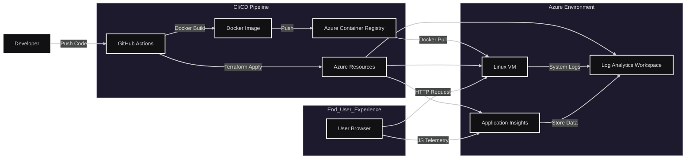

```mermaid
---
config:
  layout: dagre
  theme: redux-dark
---
flowchart LR
 subgraph CI_CD["CI/CD Pipeline"]
        AzureInfra["Azure Resources"]
        GH["GitHub Actions"]
        Image["Docker Image"]
        ACR["Azure Container Registry"]
  end
 subgraph Azure_Cloud["Azure Environment"]
        VM["Linux VM"]
        AppInsights["Application Insights"]
        LAW["Log Analytics Workspace"]
  end
 subgraph End_User_Experience["End_User_Experience"]
        Client["User Browser"]
  end
    User["Developer"] -- Push Code --> GH
    GH -- Terraform Apply --> AzureInfra
    GH -- Docker Build --> Image
    Image -- Push --> ACR
    ACR -- Docker Pull --> VM
    AzureInfra --> VM & AppInsights & LAW
    VM -- System Logs --> LAW
    AppInsights -- Store Data --> LAW
    Client -- HTTP Request --> VM
    Client -- JS Telemetry --> AppInsights
```
